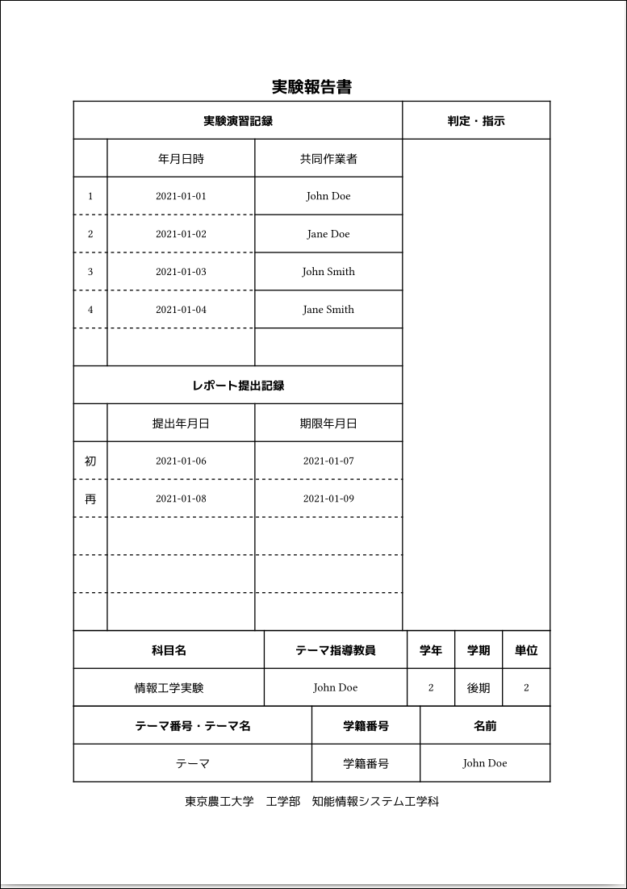

# 知能情報システム工学実験表紙(Typst版)



## 使い方

```typst
#import "@local/tuat-typst:0.1.0": *

#show: doc => tuatTemplate(// title: "実験報告書",            // タイトル(上部)
date1: "2021-01-01", // 日付1
date2: "2021-01-02", // 日付2
date3: "2021-01-03", // 日付3
date4: "2021-01-04", // 日付4
// date5: "2021-01-05",            // 日付5
collaborator1: "John Doe", // 共同作業者1
collaborator2: "Jane Doe", // 共同作業者2
collaborator3: "John Smith", // 共同作業者3
collaborator4: "Jane Smith", // 共同作業者4
// collaborator5: "John Johnson",  // 共同作業者5
submitDate: "2021-01-06", // 提出日
resubmitDate: "2021-01-08", // 再提出日
deadline: "2021-01-07", // 期限日
redeadline: "2021-01-09", // 再提出期限日
subject: "情報工学実験", // 科目
teacher: "John Doe", // テーマ指導教員
grade: "2", // 学年
semester: "後期", // 学期
credit: "2", // 単位
theme: "テーマ", // テーマ
studentId: "学籍番号", // 学籍番号
author: "名前", // 名前
doc)
```

フォントファミリーやフォントサイズ次第では1ページに収まらなくなることがあるので注意してください.

## ローカルへのインストール

以下のコマンドをコピーして実行してください.

### Linux, WSL

```bash
/bin/bash -c "$(curl -fsSL https://raw.githubusercontent.com/OJII3/tuat-typst/main/scripts/linux_install.sh)"
```

### Windows(PowerShell)
```powershell
iwr "https://raw.githubusercontent.com/OJII3/tuat-typst/main/scripts/install.ps1" | iex
```

### MacOS

```bash
/bin/bash -c "$(curl -fsSL https://raw.githubusercontent.com/OJII3/tuat-typst/main/scripts/mac_install.sh)"
```

`git` がインストールされている必要があります.

## 進捗

- [x] 表紙の見た目再現
- [x] 関数化
- [x] パッケージ化
- [x] Linux & WSL 向けインストールスクリプト (Posix shell)
- [x] Windows 向けインストールスクリプト (PowerShell)
- [x] Mac OS 向けインストールスクリプト (Posix shell)
- [ ] スターターテンプレートの作成

Inspired by [pinapplehunter/tuat-tex](https://github.com/pineapplehunter/tuat-tex)

