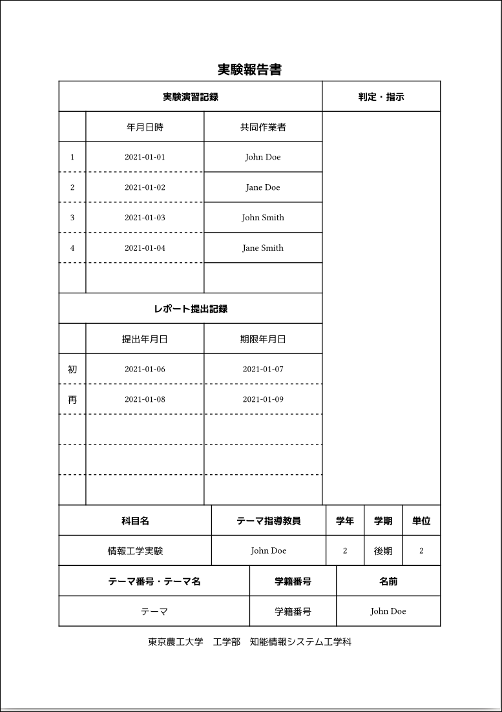

# 知能情報システム工学実験表紙 (Typst)



## インストール

Typstをインストールしたうえで、該当するコマンドを実行してください。Gitは不要です。

### Linux、macOS、WSL

```sh
script=$(mktemp) && curl -fsSL https://raw.githubusercontent.com/OJII3/tuat-typst/main/scripts/install.sh -o "$script" && /bin/sh "$script"; status=$?; rm -f "$script"; exit "$status"
```

### Windows (PowerShell)

```powershell
iwr https://raw.githubusercontent.com/OJII3/tuat-typst/main/scripts/install.ps1 | iex
```

インストール後は、Typstプロジェクトを作成して表紙のひな形を展開できます。

```sh
typst init @local/tuat-typst:0.2.0 my-report
```

## 関数の引数

日付と共同作業者は `records` に記録ごとに指定します。最大5件で、残りの枠は空欄になります。

```typst
#import "@local/tuat-typst:0.2.0": tuatTemplate

#show: tuatTemplate.with(
  records: (
    (date: "2026-10-01", collaborators: "山田 太郎、佐藤 花子"),
    (date: "2026-10-08", collaborators: "山田 太郎"),
  ),
  submitDate: "2026-10-15",
  deadline: "2026-10-22",
  subject: "情報工学実験",
  teacher: "担当教員",
  grade: "2",
  semester: "後期",
  credit: "2",
  theme: "テーマ名",
  studentId: "12345678",
  author: "山田 太郎",
)

= レポート本文

ここから本文を書きます。
```

タイトルは `title`、再提出日は `resubmitDate`、再提出期限は `redeadline` で指定できます。本文が長い場合や、フォントによっては表紙が1ページに収まらないことがあります。
