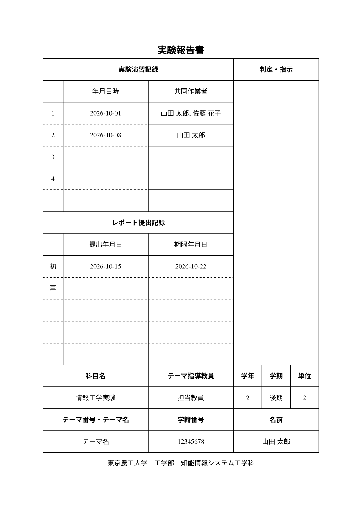

# 知能情報システム工学実験表紙 (Typst)



## インストール

Typst をインストールした上で、お使いの環境に応じたコマンドを実行してください。Git は不要です。

### Linux、macOS、WSL

```sh
script=$(mktemp) && curl -fsSL https://raw.githubusercontent.com/OJII3/tuat-typst/main/scripts/install.sh -o "$script" && /bin/sh "$script"; status=$?; rm -f "$script"; exit "$status"
```

### Windows (PowerShell)

```powershell
iwr https://raw.githubusercontent.com/OJII3/tuat-typst/main/scripts/install.ps1 | iex
```

### Nix flake

プロジェクトの `flake.nix` に `inputs` と開発シェルを追加することで、Nix store 経由で本パッケージを利用できます。Typst 本体と本パッケージは開発シェル内でのみ有効となり、ユーザー環境の Typst パッケージキャッシュにはインストールされません。

```nix
{
  inputs.tuat-typst.url = "github:OJII3/tuat-typst/v0.3.0";

  outputs = { nixpkgs, tuat-typst, ... }:
    let
      system = "x86_64-linux";
      pkgs = import nixpkgs { inherit system; };
      tuat-typst-package = tuat-typst.packages.${system}.default;
    in {
      devShells.${system}.default = pkgs.mkShell {
        packages = [ pkgs.typst tuat-typst-package ];
        TYPST_PACKAGE_PATH = "${tuat-typst-package}/share/typst/packages";
      };
    };
}
```

インストール後は、以下のコマンドで Typst プロジェクトを作成し、表紙のテンプレートを展開できます。

```sh
typst init @local/tuat-typst:0.3.0 my-report
```

## 関数の引数

日付と共同作業者は `records` に実験記録ごとに指定します。最大5件まで指定でき、残りの枠は空欄になります。

```typst
#import "@local/tuat-typst:0.3.0": tuat-title

#show: tuat-title.with(
  records: (
    (date: "2026-10-01", collaborators: "山田 太郎、佐藤 花子"),
    (date: "2026-10-08", collaborators: "山田 太郎"),
  ),
  submit-date: "2026-10-15",
  deadline: "2026-10-22",
  subject: "情報工学実験",
  teacher: "担当教員",
  grade: "2",
  semester: "後期",
  credit: "2",
  theme: "テーマ名",
  student-id: "12345678",
  author: "山田 太郎",
)

= レポート本文

ここから本文を書きます。
```

タイトルは `title`、再提出日は `resubmit-date`、再提出期限は `re-deadline` で指定できます。各項目の記述が長い場合や、フォント設定によっては表紙が1ページに収まらないことがあります。

Inspired by [pineapplehunter/tuat-tex](https://github.com/pineapplehunter/tuat-tex)
